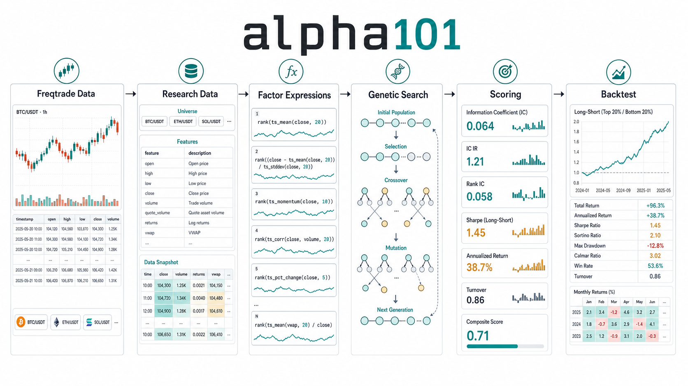
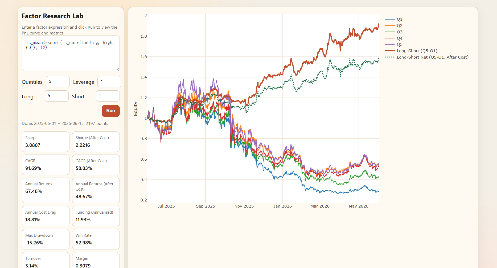
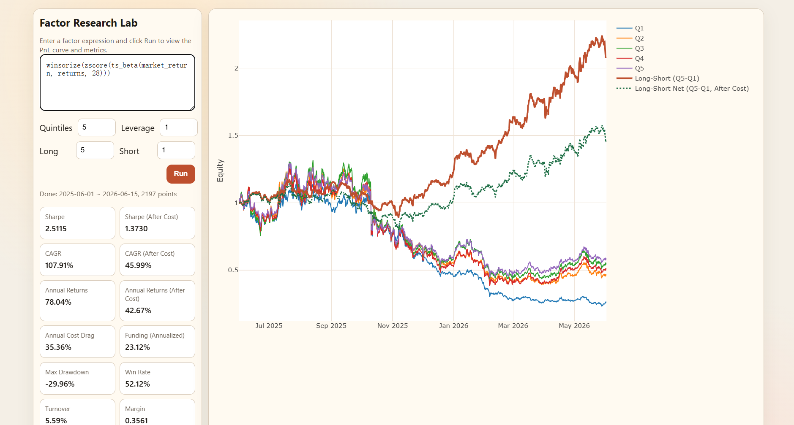
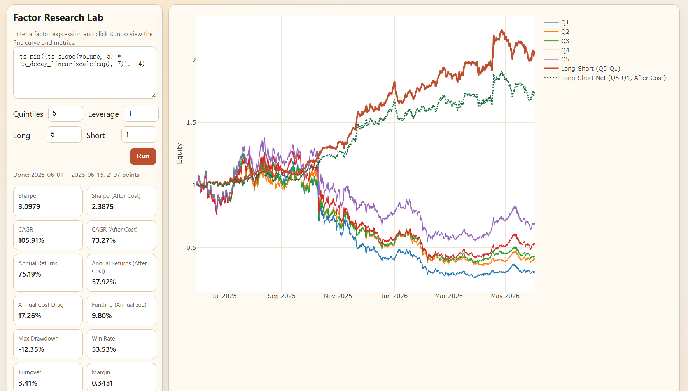

# alpha101

[中文版](README.md)


**Web Server**


<!-- <p align="center">
  
  
  
</p> -->
`alpha101` is a factor research toolkit for cryptocurrency markets. It focuses on:

- Genetic algorithm based factor mining
- Web UI for factor backtesting and inspection
- Alpha101-style factor expressions

The project uses the open-source [Freqtrade](https://github.com/freqtrade/freqtrade) framework to download exchange OHLCV data. `alpha101` organizes local data into factor research panels, then runs expression evaluation, factor search, and backtesting on top of those panels.

**This project is for learning and research only. It does not provide investment advice. Do not deploy mined factors directly in live trading.**

## Factor Examples

<p align="center">
  
  
  
</p>

## Project Layout

```text
alpha101/
  cli/                         # Command-line entry points
  data/                        # Data loading, array utilities, data views, and universe tools
    loading.py                 # Load Freqtrade feather data and build wide frames
    views.py                   # Data views used by the factor expression runtime
    arrays.py                  # Array sampling and correlation utilities
    market_caps.py             # Market cap and circulating supply metadata
    universe.py                # Binance USDT perpetual universe discovery
  factors/
    operator_lib/              # pandas factor operators, specs, and registry
    expression/                # Expression execution engine
    generation/                # Expression AST, grammar, generation, and genetic operations
    evaluation/                # Core metrics and factor scoring
    backtesting/               # Long-short portfolio backtesting
    search/                    # Factor search workflow and result management
  integrations/
    freqtrade.py               # Wrapper entry point for downloading data through Freqtrade
  research/
    server.py                  # FastAPI research server
    templates/                 # Research server pages
configs/
  alpha101.example.json        # Combined alpha101 and Freqtrade example config
3rdparty/
  freqtrade/                   # Freqtrade submodule
```

## Environment

Linux or WSL is recommended for development. Factor search may be slower on native Windows.

Create an isolated conda environment named `alpha101`:

```bash
conda create -n alpha101 python=3.12
conda activate alpha101
```

Install Freqtrade for data downloads:

```bash
git submodule update --init --recursive --depth 1 3rdparty/freqtrade
python -m pip install -r 3rdparty/freqtrade/requirements.txt
python -m pip install -e 3rdparty/freqtrade
```

Install this project from the repository root:

```bash
python -m pip install -e .
```

## Configuration

Copy the example config first, so the template file stays unchanged:

```bash
cp configs/alpha101.example.json configs/alpha101.json
```

By default, the program reads `configs/alpha101.json`. The upper section contains alpha101 research parameters, and the lower section contains the exchange and universe settings needed by Freqtrade for data downloads.

You can also specify a runtime config explicitly:

```bash
export ALPHA101_CONFIG=configs/alpha101.json
```

Windows PowerShell:

```powershell
$env:ALPHA101_CONFIG = "configs/alpha101.json"
```

## Download Data

Before using Freqtrade for the first time, create the local user directory:

```bash
freqtrade create-userdir --userdir user_data
```

If Binance access requires a proxy, configure it in `configs/alpha101.json`:

```json
{
  "exchange": {
    "ccxt_config": {
      "httpsProxy": "http://127.0.0.1:7890",
      "wsProxy": "http://127.0.0.1:7890"
    }
  }
}
```

The example port assumes a local proxy listening on `127.0.0.1:7890`. Change it to match your own proxy address if needed.

Download Binance futures data through Freqtrade:

```bash
python -m alpha101.integrations.freqtrade \
  --freqtrade-bin freqtrade \
  --config configs/alpha101.json \
  --timeframes 1h 4h 1d \
  --timerange 20260101-20260630
```

By default, the command downloads the 50 symbols configured in `configs/alpha101.json`. You can edit the config to use a different universe.

Discover the top 50 Binance USDT perpetual symbols by market cap:

```bash
python -m alpha101.data.universe \
  --top-n 50 \
  --output configs/pairs.binance-usdt-perp.json
```

The result is written to `configs/pairs.binance-usdt-perp.json`. You can copy it into `exchange.pair_whitelist` in `configs/alpha101.json`.

## Web Factor Backtesting

Start the lightweight research server:

```bash
alpha101-research-server
```

Then open:

```text
http://127.0.0.1:8001
```

The research server is useful for entering expressions, inspecting factor performance, and checking backtest metrics interactively.

## Run A Factor Expression

You can also use the command-line entry point:

```bash
alpha101-expression "ts_rank(close, 10)"
```

The expression runs on the configured data panel and prints a summary of the processed factor matrix.

## Factor Search

Run genetic search:

```bash
alpha101-factor-search \
  --config configs/alpha101.json \
  --strategy genetic \
  --population 30 \
  --generations 5 \
  --n-jobs 8
```

Search results are written to:

```text
factor_search_results/<timeframe>/
```

The factor search workflow is:

1. Generate candidate expressions from grammar rules
2. Evaluate each generation of factor matrices in batches
3. Score factors with cross-sectional forward returns, IC, return, Sharpe, and drawdown metrics
4. Continue iterating expressions through genetic operations
5. Save batch results and summary outputs


## Data Fields, Operators, and Syntax

Expressions run on wide data frames where rows are timestamps and columns are trading pairs. The currently available fields are:

- `open`, `high`, `low`, `close`, `volume`, `vwap`: base OHLCV and average price fields
- `returns`: returns computed from `close.pct_change()`
- `market_return`: market return; if `cap` is available, it uses a cap-weighted top-15 universe, otherwise it uses the cross-sectional mean
- `cap`: optional market cap field
- `funding`: optional funding-rate field

Expressions use Python-style arithmetic, comparisons, and function calls. The runtime lowercases expression code, supports `#` inline comments, and supports semicolon-separated temporary variables:

```text
x = ts_delta(close, 1);
y = ts_rank(volume, 10);
rank(x / y)
```

Common built-in functions include `abs`, `log`, `sign`, `sqrt`, `max`, `min`, and `exp`. `log` is a signed log, and `sqrt` safely handles negative values. Conditional logic can use `if_else(condition, true_val, false_val)` or `trade_when(condition, alpha, exit)`.

The core registered operators are:

```text
Single-input time-series:
  ts_mean, ts_rank, ts_min, ts_max, ts_std_dev, ts_arg_max, ts_arg_min,
  ts_sum, ts_product, ts_skewness, ts_kurtosis, ts_decay_linear,
  ts_drawdown, ts_pos, ts_zscore, ts_ema, ts_slope

Dual-input time-series:
  ts_corr, ts_covariance, ts_alpha, ts_r2, ts_beta, ts_resid

Cross-sectional:
  rank, scale, zscore, winsorize

Lag/change:
  ts_delay, ts_delta
```

The expression search generator samples candidate factors from these fields and operators. Its default grammar includes `+`, `-`, `*`, `/`, unary `log`, `-`, `abs`, `sqrt`, and `sign`, with max depth 4 and at most 8 operators. It also avoids several low-value nesting patterns, such as `ts_mean(ts_mean(...))`, `rank(rank(...))`, and `ts_corr(ts_corr(...))`.
